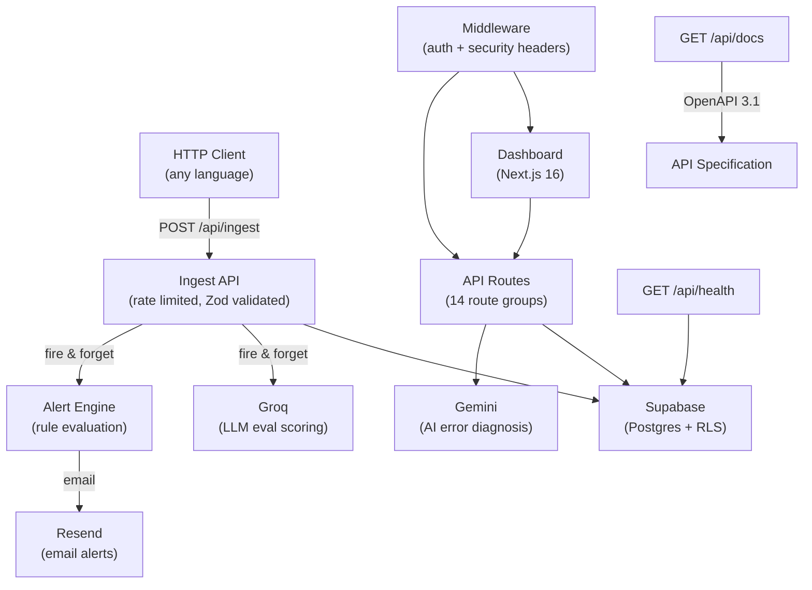

# AgentDecode

**Open-source observability for AI agents.** Trace every LLM call, tool execution, and decision your agent makes — then debug failures with AI-powered diagnostics.

[](https://nextjs.org/)
[](https://www.typescriptlang.org/)
[](https://supabase.com/)
[](LICENSE)

---

## What is AgentDecode?

AI agents are opaque. When they fail, you get a stack trace — not an explanation. AgentDecode gives you full visibility into every step:

- **Trace** LLM calls, tool executions, retrieval steps, and agent decisions in a hierarchical timeline
- **Auto-evaluate** response quality with Groq-powered scoring (0–10 scale)
- **Debug** failures with AI-generated root cause analysis and suggested fixes
- **Monitor** error rates, latency, and costs with real-time analytics
- **Alert** on error rate spikes, latency regressions, or cost anomalies
- **Export** high-quality traces as fine-tuning datasets (JSONL format)
- **Compare** sessions side-by-side to spot regressions
- **Search** across all sessions and spans with ⌘K command palette

## Tech Stack

| Layer | Technology |
|-------|-----------|
| Frontend | Next.js 16, React 18, TypeScript |
| Styling | Tailwind CSS, shadcn/ui, Satoshi + Clash Display fonts |
| Database | Supabase (Postgres + Row Level Security) |
| Auth | Supabase Auth (email/password + Google OAuth) |
| AI — Eval Scoring | Groq (llama-3.3-70b-versatile) |
| AI — Error Diagnosis | Google Gemini (gemini-2.0-flash) |
| Email | Resend |
| SDK | TypeScript (CJS/ESM via tsup) |

**Total cost to run: $0.** Everything uses free tiers.

---

## Getting Started

### Prerequisites

- Node.js 18+
- A [Supabase](https://supabase.com) account (free tier)
- A [Groq](https://console.groq.com) API key (free tier)

### 1. Clone the repo

```bash
git clone https://github.com/your-username/agentdecode.git
cd agentdecode/agentdecode
```

### 2. Install dependencies

```bash
npm install
```

### 3. Set up Supabase

1. Create a new Supabase project at [supabase.com/dashboard](https://supabase.com/dashboard)
2. Go to **SQL Editor** and run the contents of [`supabase/migrations/001_initial_schema.sql`](supabase/migrations/001_initial_schema.sql)
3. Go to **Authentication → Providers** and enable Email and (optionally) Google OAuth

### 4. Configure environment variables

```bash
cp .env.local.example .env.local
```

Fill in the values from your Supabase dashboard and API keys.

### 5. Run the dev server

```bash
npm run dev
```

Open [http://localhost:3000](http://localhost:3000) — you'll see the landing page. Sign up to access the dashboard.

---

## Project Structure

```
agentdecode/
├── app/
│   ├── (auth)/          # Login, signup, password reset
│   ├── (dashboard)/     # Protected dashboard pages
│   │   ├── dashboard/   # Projects list, issues, team, docs, settings
│   │   ├── projects/    # Project detail, analytics, alerts, compare
│   │   └── sessions/    # Session detail with trace viewer
│   ├── api/             # API routes (ingest, keys, projects, search, etc.)
│   └── page.tsx         # Public landing page
├── components/          # Reusable UI components
│   ├── ui/              # shadcn/ui primitives
│   ├── dashboard/       # Dashboard-specific components
│   ├── sessions/        # Session table, trace viewer
│   └── charts/          # Recharts wrappers
├── lib/                 # Utilities
│   ├── supabase/        # Client & server Supabase clients
│   ├── groq.ts          # Groq eval scoring
│   ├── gemini.ts        # Gemini error diagnosis
│   ├── rate-limit.ts    # Token bucket rate limiter
│   └── alerts.ts        # Alert rule evaluation
├── __tests__/           # Integration & unit tests
├── supabase/
│   └── migrations/      # Database schema (SQL)
└── types/               # Shared TypeScript interfaces
```

## Integration

AgentDecode uses a simple HTTP API — **no SDK installation required**. Send traces from any language using a POST request.

```javascript
const response = await fetch('https://your-app.vercel.app/api/ingest', {
  method: 'POST',
  headers: {
    'Authorization': 'Bearer al_your_api_key',
    'Content-Type': 'application/json'
  },
  body: JSON.stringify({
    session_name: 'My Agent Session',
    spans: [
      {
        name: 'classify_intent',
        span_type: 'llm',
        status: 'ok',
        model: 'gpt-4o',
        started_at: new Date().toISOString(),
        ended_at: new Date().toISOString(),
        duration_ms: 450,
        input: { message: 'I need help with my order' },
        output: { intent: 'support', confidence: 0.95 },
        input_tokens: 45,
        output_tokens: 12,
        cost_usd: 0.0001
      }
    ]
  })
});
```

See the in-app **Documentation** page for Python examples, parent-child span linking, error tracking, and the full API reference.

---

## Deploying to Vercel

1. Push your repo to GitHub
2. Import the project in [Vercel](https://vercel.com/new)
3. Set the **Root Directory** to `agentdecode`
4. Add all environment variables from `.env.local.example`
5. Deploy

The app will be live at `your-project.vercel.app`.

---

## Testing

```bash
# Unit & integration tests
npm run test

# Watch mode
npm run test:watch

# Coverage report
npm run test:coverage

# E2E tests (requires running dev server)
npm run test:e2e

# Type checking
npm run type-check

# Linting
npm run lint
```

---

## Architecture



---

## API Reference

The full API specification is available as an OpenAPI 3.1 JSON document:

```
GET /api/docs
```

This endpoint is publicly accessible (no auth required) and returns the complete spec for all 14 API route groups.

---

## Environment Variables

| Variable | Required | Description |
|----------|----------|-------------|
| `NEXT_PUBLIC_SUPABASE_URL` | ✅ | Your Supabase project URL |
| `NEXT_PUBLIC_SUPABASE_ANON_KEY` | ✅ | Supabase anonymous key (public) |
| `SUPABASE_SERVICE_ROLE_KEY` | ✅ | Supabase service role key (server-only, bypasses RLS) |
| `GROQ_API_KEY` | ✅ | Groq API key for eval scoring |
| `GEMINI_API_KEY` | Optional | Google Gemini key for AI error diagnosis |
| `RESEND_API_KEY` | Optional | Resend key for alert emails |
| `NEXT_PUBLIC_SITE_URL` | Optional | Your deployment URL (for SDK snippets) |
| `LOG_LEVEL` | Optional | Minimum log level: `debug`, `info`, `warn`, `error` |

---

## Contributing

We welcome contributions! See our [Contributing Guide](.github/CONTRIBUTING.md) for:

- Development setup
- Branch naming and PR workflow
- Testing requirements
- Code style guidelines

---

## License

MIT
